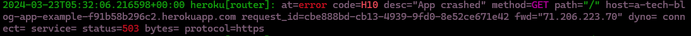

# Tech Blog

## Description
    The Tech Blog is a blogging app that allows users to connect with each other over the shared topic of programming. Users can make accounts, share their thoughts, and receive feedback from others. This app was created with several programs, including express, MySql, sequelize, and handlebars. Tech Blog has been deployed on Heroku.

## Visuals
    Unfortunately, at the time I'm writing this, I keep receiving a **503 ERROR**, basically telling me that the server isn't connecting with no fault of my own. As such, I haven't been able to see what my own work has looked like, which isn't exactly fantastic for a developer. But, alas, all I can really do is show the proof at this point.



Here **is** the link to the app wwhenever it decides to function once more: <a href="https://a-tech-blog-app-example-f91b58b296c2.herokuapp.com/">Click Here!</a>


## Installation
    As this app is being hosted on Heroku, all someone needs is the link to open the site. It's blessedly simple this time around. 

## Usage
    Were the site connecting, Users would be able to sign up with a username and password for their own account. They would be able to browse post entries, post their own entries, and comment on other entries. Users would also be abled to log out, and login, to the site as they pleased with the knowledge that their information is encrypted for their safety.

## Support
    If you're having any trouble at all, feel free to find me on GitHub, or via my email leesamarie95@gmail.com. I'll do my best to answer any questions you have. If you can't get a hold of me for some reason, Stack Overflow, the GitHub Forums, or other coding forums may have the answers you're looking for as well.

## Roadmap
    One of my biggest hopes for the future is to actually **see** what's going on, and to adjust the cosmetics of the site. I would like to, in the future, add the option of posting blocks of code as well, and the ability to share outside articles. 

## Contributing
    I'm more than happy to have contributions! I'd be eager for help when it comes to, well, anything! Considering the connectivity issue has been a thorn in my side, I'll I can hope is that one day I'll be able to work with a couple of people on implementing those options from the Roadmap section. 

    To replicate the information and data, you'll need to to do an ```npm install``` and an ```npm start``` to see everything, given that every seeds properly. It would be best to also have MySql on your computer so the data runs through the seeding process properly.

## Authors and Acknowledgements
    I'm going to be quite frank: I had **no** clue how to structure some of these things. I went through a lot of repositories of a similar style just to understand what I was doing, especially with the handlebars section and some of the logic, so I'd like to shout out the repos I looked at the most:
    <a href="https://github.com/Lyman17">BLyman</a>, <a href="https://github.com/mvfranzke">mvfranzke</a>, <a href="https://github.com/ckim812">ckim812</a>, <a href="https://github.com/catxcoding">Cat Thompson (catxcoding)</a>, and <a href="https://github.com/ocarly">Carly C. (ocarly)</a>. I would have had such a hard time without the guidance of all of your stellar codes steering me in the right direction.

    I'd also like to thank my teachers and fellow classmates too, of course. They all had some wonderful insights and it helped keep my head on straight instead of giving up. 


## License
MIT License

Copyright (c) 2023 LeesaM95

Permission is hereby granted, free of charge, to any person obtaining a copy of this software and associated documentation files (the "Software"), to deal in the Software without restriction, including without limitation the rights to use, copy, modify, merge, publish, distribute, sublicense, and/or sell copies of the Software, and to permit persons to whom the Software is furnished to do so, subject to the following conditions:

The above copyright notice and this permission notice shall be included in all copies or substantial portions of the Software.

## Project Status

This project has been a nightmare for me, to be honest, and I'll be keeping it on the back burner for the time being until I'm no longer frustrated by just looking at the title of this thing. It would be nice to have it working properly for a portfolio one day.